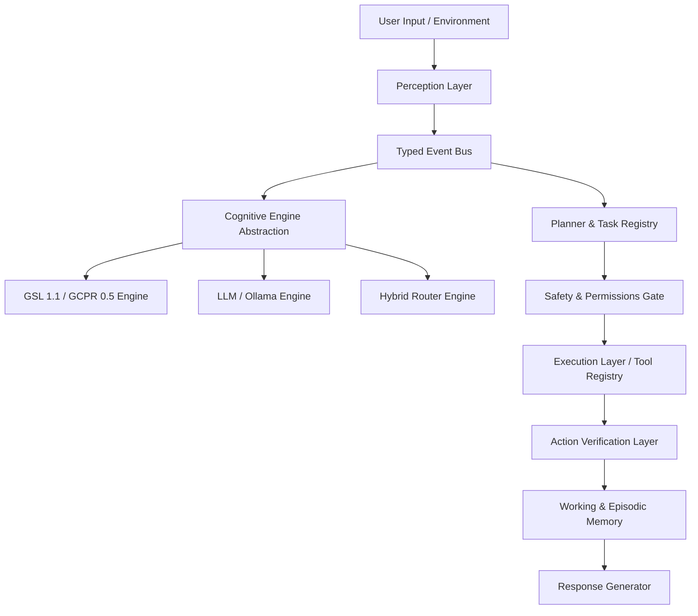

# J.A.R.V.I.S. Core Operating System Architecture

This document defines the high-level, multi-layered cognitive and execution architecture of the **J.A.R.V.I.S. (Joint Automated Real-time Very Intelligent System)** personal AI agent.

---

## 1. HIGH-LEVEL ARCHITECTURAL BLUEPRINT

JARVIS is structured around a decoupled, local-first, event-driven architecture. Unlike simple chat wrapper APIs, JARVIS translates perceptual input events into structural cognitive models, formulates risk-aware plans, executes tools, and strictly verifies execution state.

---

## 2. MODULAR MODULE INDEX

The repository is mapped into standard logical domains:

*   **`jarvis/input/`**: Raw interface streams and terminal bindings.
*   **`jarvis/perception/`**: Normalizes textual, audio, and visual streams into unified `PerceptionEvent` objects.
*   **`jarvis/cognition/`**: Defines the `CognitiveEngine` abstraction supporting `GILLMEngine`, `LLMEngine`, and `HybridEngine`.
*   **`jarvis/memory/`**: Manages separate Working, Episodic, Semantic, and Procedural memory controllers.
*   **`jarvis/knowledge/`**: Directs retrieval-augmented indexing over local notes, document files, and web sources.
*   **`jarvis/planning/`**: Creates explicit checklists of dependent tasks based on structured intent.
*   **`jarvis/tools/`**: A typed registry defining filesystem, terminal, browser, and OS API actions.
*   **`jarvis/execution/`**: Runs sandboxed commands and scripts with permission gates.
*   **`jarvis/verification/`**: Checks system state post-execution (e.g. verifying a process actually spawned on the OS) to guarantee success.
*   **`jarvis/security/`**: A centralized risk authorization layer gating destructive commands.
*   **`jarvis/voice/` & `jarvis/vision/`**: Multi-modal sensory processing and text-to-speech/speech-to-text.

---

## 3. THE COGNITIVE ABSTRACTION

To avoid hardcoded model dependency, JARVIS delegates understanding to a standard `CognitiveEngine` interface:

*   **`GILLMEngine`**: Deterministic compositional Pre-processor and Validator. Highly trace-inspectable, extremely fast, and uses under 200 KB RAM.
*   **`LLMEngine`**: Stochastic generative assistant, perfect for open-ended creative tasks.
*   **`HybridEngine`**: The recommended router. Routes deterministic, structural, and safety-critical commands to GILLM, and delegates open-ended queries to local or cloud LLM adapters.
