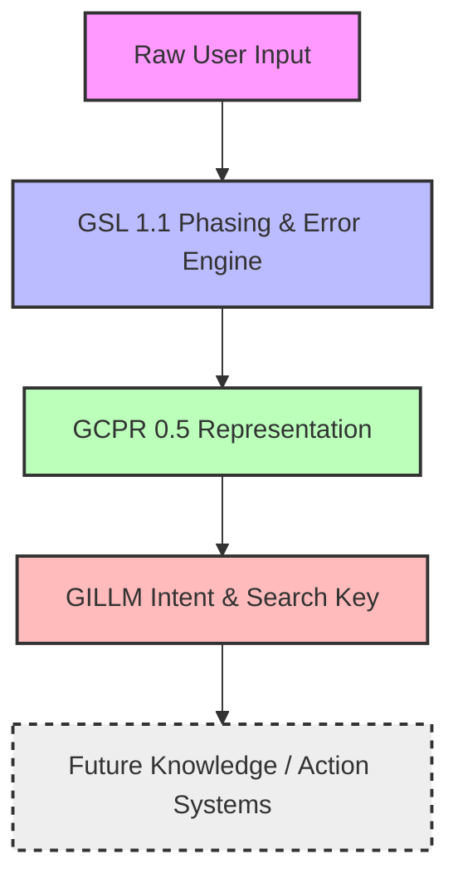
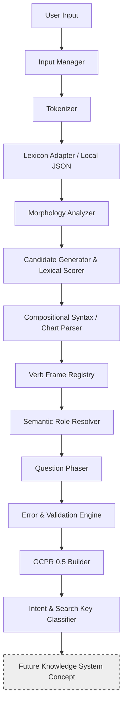
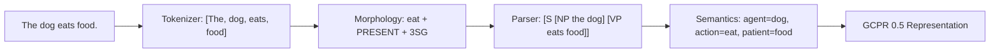

# GILLM — Genius Intelligence Language Learning Model

### Project Master Version Map:
*   **Overall GILLM Milestone**: `GILLM 0.5.0` (Experimental Prototype)
*   **Language-Phasing Engine**: `GSL 1.1` (GILLM Structure Library)
*   **Intermediate Contract Representation**: `GCPR 0.5` (GILLM Common Phase Representation)

---

## 1. PROJECT OVERVIEW

GILLM (Genius Intelligence Language Learning Model) is an experimental research architecture for language understanding based on explicit linguistic structure. Rather than treating natural language processing as an opaque, statistical black box (as seen in conventional neural-network large language models), GILLM investigates whether language can be understood by incrementally phasing inputs into progressively richer, compositional, and fully inspectable structural representations.



### The Central Phasing Pipeline:
```
Raw Language → Tokens → Morphology → Lexical Candidates → Syntax → Semantic Roles → Question/Intent Structure → GCPR 0.5 → Future Knowledge Map
```

> **Crucial Version Disclaimer**: GSL 1.1 is **NOT** intended to understand all human language. The objective of GSL 1.1 is to establish a deterministic, compositional, and completely traceable language-processing and error-detection foundation that can be expanded incrementally.

---

## 2. WHAT IS GSL?

**GSL** stands for **GILLM Structure Library**. It is the modular, deterministic, and compositional language-processing and error-detection foundation of the GILLM project.

GSL is responsible for converting raw, natural-language input into a structured contract representation called **GCPR** (GILLM Common Phase Representation) without making premature guesses.

### The GSL 1.1 Processing Pipeline:


---

## 3. GSL 1.1 MODULAR ARCHITECTURE

GSL is built on the strict software engineering principle of **separation of concerns**. To prevent the system from committing prematurely to a single interpretation, each module operates on candidate groups and propagates evidence.

### Module Catalog:

| Module | Purpose | Input | Output |
| :--- | :--- | :--- | :--- |
| `input/` | Manages string preprocessing and tokenization | Raw `str` | `List[Token]` |
| `lexicon/` | Provides local vocabulary dictionary lookups and adapters | Word `str` | `LexicalEntry` candidates |
| `morphology/` | Generates possible morphological analyses without committing | Lemma `str` | `List[MorphologicalAnalysis]` |
| `candidates/` | Builds lexical candidate objects and scores them | `List[Token]` | `List[List[Candidate]]` |
| `syntax/` | Compositional chart parser applying recursive grammar rules | `List[List[Candidate]]` | `List[ParseNode]` candidate trees |
| `grammar/` | Governs agreement constraints and GCPR transformations | `GCPR` | Transformed `GCPR` |
| `semantics/` | Resolves action-specific semantic argument roles | `ParseNode` | `Dict[str, Any]` semantic roles |
| `questions/` | Discovers missing semantic slot expectations from query syntax | `ParseNode` + roles | Question family & expected answer |
| `error/` | Validates grammatical/selectional rules and identifies error objects | Tokens + `GCPR` | `List[ErrorObject]` and validation status |
| `gcpr/` | Constructs and validates the final JSON contract structure | `GCPR` components | Standardized JSON representation |
| `conversation/`| Tracks conversation history and pronoun reference links | Turns data + `GCPR` | Resolved coreferences |
| `intent/` | Extracts the core user intent and generates SearchKeys | `GCPR` dictionary | `SearchKey(concept, intent)` |
| `response/` | Realizes surface language text back from structural GCPR | `GCPR` | Output `str` sentence |
| `trace/` | Exposes the reasoning and decision evidence of each phase | Pipeline steps | `PhaseTrace` execution log |

---

## 4. GILLM COMMON PHASE REPRESENTATION (GCPR 0.5)

The **GCPR 0.5** is the stable, standardized intermediate contract representation used between the GSL 1.1 language-processing layers and future GILLM reasoning systems.

### Conceptual Structure:
For the input: `"The boy opened the door."`

```json
{
  "surface": {
    "original_text": "The boy opened the door.",
    "tokens": [
      {"text": "The", "type": "WORD"},
      {"text": "boy", "type": "WORD"},
      {"text": "opened", "type": "WORD"},
      {"text": "the", "type": "WORD"},
      {"text": "door", "type": "WORD"},
      {"text": ".", "type": "PUNCTUATION"}
    ]
  },
  "linguistic": {
    "sentence_type": "statement",
    "morphology": {
      "tense": "PAST"
    },
    "grammar": {
      "tense": "PAST",
      "polarity": "POSITIVE"
    },
    "syntax": {
      "voice": "ACTIVE",
      "labels": "S"
    }
  },
  "semantic": {
    "roles": {
      "action": "open",
      "agent": "boy",
      "patient": "door"
    },
    "entities": {
      "boy": {
        "lemma": "boy",
        "status": "PRESERVED_FOR_FUTURE_COREFERENCE",
        "pos": "NOUN"
      },
      "door": {
        "lemma": "door",
        "status": "PRESERVED_FOR_FUTURE_COREFERENCE",
        "pos": "NOUN"
      }
    },
    "relations": []
  },
  "conversation": {
    "role": null,
    "question_family": null,
    "expected_answer": null
  },
  "intent": "STATEMENT",
  "uncertainty": {
    "ambiguous": false,
    "alternatives": [],
    "confidence": 1.0
  },
  "gsl_version": "1.1",
  "gcpr_version": "0.5",
  "gillm_version": "0.5.0",
  "errors": [],
  "speech_act": "STATEMENT",
  "temporal_relations": [],
  "discourse_relations": [],
  "figurative_language": {
    "is_figurative": false,
    "type": null,
    "metadata": {}
  },
  "exercises": {
    "fill_in_blanks_candidates": [ ... ],
    "grammar_transformations": {
      "can_transform_passive": true
    }
  },
  "bidirectional_validation": {
    "consistent": true,
    "notes": [ ... ]
  }
}
```

---

## 5. QUESTION PHASING & SEMANTIC SLOT RESOLUTION

GSL 1.1 does **NOT** treat question processing as simple keyword mappings. Instead, it uses **Syntax + Verb Frames + Semantic Roles** to determine exactly which slot is missing.

### Demonstration:

#### Case A: `"Who opened the door?"`
1. **Who** has category `PERSON`.
2. Parser identifies `Who` as the syntactic Subject.
3. Verb frame of **open** expects `AGENT` and `PATIENT`.
4. "door" fills the `PATIENT` role.
5. `Who` maps to the unknown syntactic Subject, meaning:
   * **Missing Slot**: `AGENT` = `unknown`
   * **Expected Answer**: `PERSON`

#### Case B: `"Who did the boy see?"`
1. **Who** has category `PERSON`.
2. Parser identifies `boy` as the syntactic Subject of **see**.
3. Verb frame of **see** expects `EXPERIENCER` and `PATIENT`.
4. "boy" fills the `EXPERIENCER` role.
5. `Who` maps to the fronted Object, meaning:
   * **Missing Slot**: `PATIENT` = `unknown`
   * **Expected Answer**: `PERSON`

---

## 6. PRESERVING AMBIGUITY

Unlike standard NLP parsers that guess a single meaning immediately, GSL is designed to preserve multiple competing candidate structures if the evidence is insufficient to distinguish them.

For example, in the sentence `"I saw her duck."`:
* **Interpretation 1 (Noun interpretation)**: `[S [NP: I] [VP: saw [NP: [Det: her] [Noun: duck]]]]` (I saw the bird belonging to her)
* **Interpretation 2 (Verb interpretation)**: `[S [NP: I] [VP: saw [NP: [Pron: her]] [VP: duck]]]` (I watched her lower her body)

GSL's chart parser generates both valid trees, scores them, and since their scores are close, sets `"ambiguous": true` and lists the second tree under `"alternatives"` in GCPR 0.5.

---

## 7. WORD & TYPO CORRECTION

Typo correction in GSL is deterministic, context-aware, and does **not** rely on hard-coded mappings.

```
Input: "hte"
   ↓
[Levenshtein Edit Distance (dist <= 2)]
   ↓
Correction Candidates: "the" (DET), "he" (PRON)
   ↓
[Grammatical Context Check: "hte boy" -> DET + NOUN -> NP]
   ↓
Selected Candidate: "the" (DET)
```
*Original surface text is always fully preserved in `surface.original_text`.*

---

## 8. EVOLUTION FROM GILLM 0.5.0

*   **GILLM 0.5.0 (Experimental Prototype)**: Initial experimental prototype exploring token patterns, lexical lookups, and explicit structure phasing.
*   **GSL 1.1 (Current Language Phasing Engine)**: Featuring strict error and validation analysis, bidirectional verification, speech acts, and temporal/discourse relation tracking.
*   **Future GILLM Milestones**: Planned additions of vector map representations, proactive execution systems, and Jarvis automation.

---

## 9. GILLM VS CONVENTIONAL LLMs

| Dimension | Typical LLM | GILLM/GSL 1.1 (Proposed Architecture) |
| :--- | :--- | :--- |
| **Representation** | Unlabeled vector parameters | Explicitly labeled linguistic trees & GCPR 0.5 |
| **Learning Mechanism** | Statistical token correlation | Compositional grammatical rules & Lexicon |
| **Grammar** | Latent in network weights | Rule-based parser & morphological composition |
| **Ambiguity** | Forced sample / token logits | Preserved explicit alternative GCPR records |
| **Interpretability** | Black-box attention weights | 100% explainable PhaseTrace log |
| **Knowledge Storage**| Memorized in weights | Structured decoupled Knowledge Registry (concept) |
| **Inference** | Autoregressive token sampling | Deterministic chart parsing & role unification |
| **Extensibility** | Costly retrain / fine-tune | Modifying local JSON Lexicon & Grammar Rules |
| **Data Requirements**| Terabytes of crawl text | Minimal grammar rules & local vocabulary |
| **Current Maturity** | Mature industrial technology | **Experimental prototype** |

---

## 10. WHY GILLM IS DIFFERENT

GILLM's research motivation is to examine if explicit linguistic structure can serve as a robust, safe, and explainable foundation for knowledge representation and reasoners, rather than generating text from statistics alone.

Our core design principles are:
*   **"Structure before intelligence"**
*   **"Do not guess prematurely"**

---

## 11. ROADMAP

```
GILLM 0.5.0 / GSL 1.0 (Compositional Phasing & GCPR)
    ↓
GILLM 0.5.0 / GSL 1.1 / GCPR 0.5 (Error Analysis & Structural Verification) [CURRENT]
    ↓
GILLM 1.x (Extended Grammar & Phrase Realization) [PLANNED]
    ↓
GILLM 2.0 (Structured 3D Knowledge Registry) [PLANNED]
    ↓
GILLM 3.0 (Proactive Intelligence & Tools Automation) [PLANNED]
    ↓
Jarvis-inspired Autonomous System [FUTURE RESEARCH CONCEPT]
```

---

## 12. WORD GENERATION RESEARCH

In future iterations, GSL aims to support automatic word generation and phrase compound composition from morphological roots and derivational constraints:
```
Roots + Morphological Suffix Rules + Semantic Categories + Context → Structurally Valid Word Forms
```

---

## 13. ABSTRACT REPRESENTATION

GSL progressively decouples surface language from abstract structure:
*   **Surface**: `"The boy opened the door."`
*   **Abstract Representation**:
    ```
    AGENT: boy
    ACTION: open
    PATIENT: door
    TENSE: past
    VOICE: active
    ```

---

## 14. KNOWLEDGE HUB & FUTURE 3D MAPS

Our planned GILLM 2.0 research milestone introduces an experimental structured relationship map where knowledge entities represent coordinates and topics correspond to hubs:

```
GSL → GCPR → Intent → Search Key → Knowledge Hub → Topic Relationship → Document Map
```

---

## 15. VISUAL PIPELINE SUMMARY

### GSL 1.1 Phasing Pipeline:


---

## 16. REPOSITORY DOCUMENTATION

### Installation:
```bash
git clone https://github.com/user/GILLM.git
cd GILLM
```

### Running Interactive Shell:
```bash
python runner.py
```

### Running Tests:
```bash
pytest -q
```

### Example Interactive Session:
```
You > Who opened the door?
GILLM >
Question detected.
Expected answer: PERSON.
Generated SearchKey: (concept='door', intent='person')
```

### Enabling Trace Diagnostics:
Use `/debug on` to view the step-by-step pipeline logging:
```
You > /debug on
System > PhaseTrace debug is now ENABLED.

You > Did the dog eat food?
GILLM >
Question detected.
Expected answer: BOOLEAN.

========================================
DEBUG PHASING TRACE:
========================================
=== INPUT ===
Did the dog eat food?

=== TOKENIZATION ===
Did | the | dog | eat | food | ?

...
========================================
```

---

## 17. DEVELOPMENT STATUS

| Component | Status |
| :--- | :--- |
| **Input Manager** | Implemented |
| **Tokenizer** | Implemented (Supporting Contractions) |
| **Lexicon Adapter & JSON** | Implemented |
| **Morphological Analyzer** | Implemented |
| **Candidate Generator & Scorer**| Implemented |
| **Compositional Chart Parser** | Implemented |
| **Verb Frame Registry** | Implemented |
| **Semantic Role Resolver** | Implemented |
| **Question Phaser** | Implemented |
| **GCPR Builder & Validator** | Implemented |
| **Modular Error Detectors** | Implemented (14 error classes) |
| **Bidirectional Validator** | Implemented |
| **Temporal & Discourse Relations**| Experimental Extension |
| **Speech Act Intent Classifier**| Experimental Extension |
| **Figurative Language Parser** | Experimental Extension |
| **Exercise Generation System** | Experimental Extension |
| **3D Knowledge Map** | Planned (GILLM 2.0) |
| **Proactive automation system**| Planned (GILLM 3.0) |

---

## 18. DESIGN PRINCIPLES

1. **Structure before generation.** Explicit linguistic parsing is the foundation of all intelligence layers.
2. **Do not guess prematurely.** Generate candidate sets, score them, and preserve alternatives when scores are close.
3. **Preserve ambiguity.** Represent competing structures in GCPR rather than forcing premature convergence.
4. **Separate syntax from semantics.** Distinguish word groupings from their underlying meaning.
5. **Separate POS from semantic roles.** Never assume noun is always agent or verb is always action.
6. **Normalize lemmas before verb-frame lookup.** Eliminate inflection-specific special casing.
7. **Preserve original input.** Original spelling and punctuation must always be fully preserved.
8. **Make intermediate representations inspectable.** Keep the engineering decisions clear and debuggable.
9. **Prefer reusable rules.** Avoid sentence-specific hacks; build through grammatical composition.
10. **Decouple GSL from downstream logic.** GSL serves as an independent structure library.

---

## 19. RESEARCH DISCLAIMER

GILLM/GSL is an experimental, non-commercial, proof-of-concept research project investigating rule-based compositional grammar structures as an alternative or complementary foundation to statistical LLMs. This project does not claim to surpass modern commercial LLMs in vocabulary breadth or natural conversational fluency, but proposes a structured paradigm for explainable language interaction.

---

## 20. LICENSE

Distributed under the MIT License. See `LICENSE` for more information.
