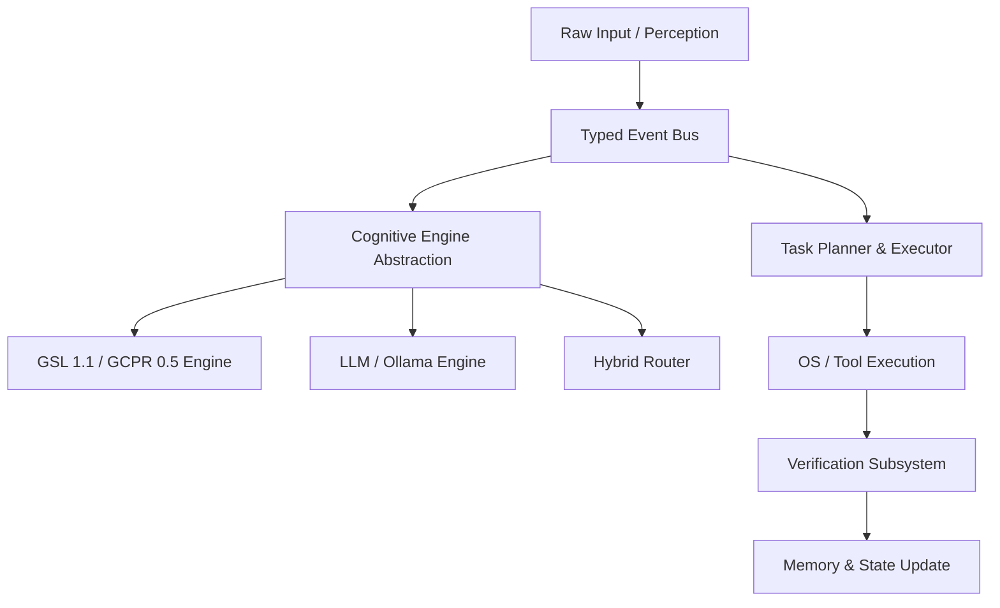
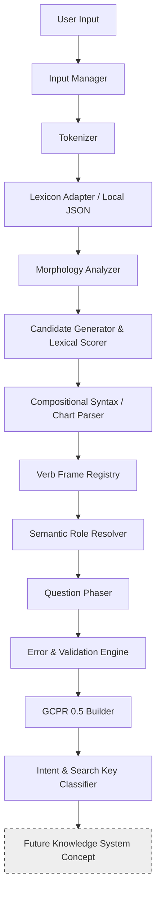

# J.A.R.V.I.S. — Cognitive & Language Operating System

### Project Master Version Map:
*   **System Milestone**: `J.A.R.V.I.S. Phase 1` (Active Agent Core)
*   **Cognitive GILLM Architecture**: `GILLM 0.5.0` (Experimental Prototype)
*   **Language-Phasing Engine**: `GSL 1.1` (GILLM Structure Library)
*   **Intermediate Contract Representation**: `GCPR 0.5` (GILLM Common Phase Representation)

---

## 1. THE JARVIS OS VISION

J.A.R.V.I.S. (Joint Automated Real-time Very Intelligent System) is a persistent, multi-modal, local-first personal AI operating system. JARVIS is built around the core architectural principle that an agent must do more than simply chat; it must perceive, remember, plan, execute, observe, verify, and learn.



### The Core Agent Event Lifecycle Loop:
```
RECEIVE → UNDERSTAND → CLASSIFY → RETRIEVE CONTEXT → PLAN → AUTHORIZE → EXECUTE → OBSERVE → VERIFY → UPDATE MEMORY → RESPOND
```

---

## 2. GILLM AS THE COGNITIVE PRE-PROCESSOR

**GILLM** is the experimental cognitive and language architecture inside JARVIS. Driving GSL 1.1, GILLM is responsible for parsing raw, natural-language inputs into a structured contract representation called **GCPR 0.5** without relying on stochastic cloud LLMs.

### The GSL 1.1 Phasing Pipeline:


---

## 3. MODULAR ARCHITECTURE MODULE INDEX

The repository is built on strict modularity, allowing down-stream cognition, memory, or voice elements to be swapped out seamlessly:

### JARVIS Core Packages:
*   **`jarvis/events/`**: A decoupled, typed, thread-safe Event Bus publishing UserInput, Perception, ToolCall, ToolResult, Verification, and Response events.
*   **`jarvis/input/`**: Consumes raw terminal input, system triggers, or file streams.
*   **`jarvis/perception/`**: Normalizes textual, auditory, and visual streams into unified `PerceptionEvent` objects.
*   **`jarvis/cognition/`**: Defines the `CognitiveEngine` interface supporting `GILLMEngine`, `LLMEngine`, and `HybridEngine`.
*   **`jarvis/memory/`**: Separates Working, Episodic, Semantic, and Procedural memory controllers.
*   **`jarvis/planning/`**: Generates explicit checklists of dependent tasks based on structured intent.
*   **`jarvis/tools/`**: A typed tool registry defining OS-level terminal, browser, and filesystem actions.
*   **`jarvis/execution/`**: Runs sandboxed commands and scripts with permission gates.
*   **`jarvis/verification/`**: Checks system state post-execution (e.g. verifying a process actually spawned on the OS) to guarantee success.
*   **`jarvis/security/`**: A centralized risk authorization layer gating destructive commands.
*   **`jarvis/voice/` & `jarvis/vision/`**: Multi-modal sensory processing and text-to-speech/speech-to-text.

### GSL 1.1 Structural Packages:
*   **`gillm/input/`**: Manages string preprocessing and tokenization.
*   **`gillm/gsl/lexicon/`**: Local vocabulary lookups and extensible loaders.
*   **`gillm/gsl/morphology/`**: Generates possible morphological analyses without committing.
*   **`gillm/gsl/syntax/`**: Compositional chart parser applying recursive grammar rules.
*   **`gillm/gsl/semantics/`**: Resolves action-specific semantic argument roles.
*   **`gillm/gsl/error/`**: Analyzes 14 categories of grammatical, spelling, and semantic errors.
*   **`gillm/gsl/gcpr/`**: Constructs and validates the final JSON contract structure.
*   **`gillm/response/`**: Realizes surface language text back from structural GCPR.

---

## 4. GILLM COMMON PHASE REPRESENTATION (GCPR 0.5)

The **GCPR 0.5** is the stable, standardized intermediate contract representation used between the GSL 1.1 language-processing layers and JARVIS OS.

### Conceptual Structure:
For the input: `"The boy opened the door."`

```json
{
  "surface": {
    "original_text": "The boy opened the door.",
    "tokens": [
      {"text": "The", "type": "WORD"},
      {"text": "boy", "type": "WORD"},
      {"text": "opened", "type": "WORD"},
      {"text": "the", "type": "WORD"},
      {"text": "door", "type": "WORD"},
      {"text": ".", "type": "PUNCTUATION"}
    ]
  },
  "linguistic": {
    "sentence_type": "statement",
    "morphology": {
      "tense": "PAST"
    },
    "grammar": {
      "tense": "PAST",
      "polarity": "POSITIVE"
    },
    "syntax": {
      "voice": "ACTIVE",
      "labels": "S"
    }
  },
  "semantic": {
    "roles": {
      "action": "open",
      "agent": "boy",
      "patient": "door"
    },
    "entities": {
      "boy": {
        "lemma": "boy",
        "status": "PRESERVED_FOR_FUTURE_COREFERENCE",
        "pos": "NOUN"
      },
      "door": {
        "lemma": "door",
        "status": "PRESERVED_FOR_FUTURE_COREFERENCE",
        "pos": "NOUN"
      }
    },
    "relations": []
  },
  "conversation": {
    "role": null,
    "question_family": null,
    "expected_answer": null
  },
  "intent": "STATEMENT",
  "uncertainty": {
    "ambiguous": false,
    "alternatives": [],
    "confidence": 1.0
  },
  "gsl_version": "1.1",
  "gcpr_version": "0.5",
  "gillm_version": "0.5.0",
  "errors": [],
  "speech_act": "STATEMENT",
  "temporal_relations": [],
  "discourse_relations": [],
  "figurative_language": {
    "is_figurative": false,
    "type": null,
    "metadata": {}
  },
  "exercises": {
    "fill_in_blanks_candidates": [ ... ],
    "grammar_transformations": {
      "can_transform_passive": true
    }
  },
  "bidirectional_validation": {
    "consistent": true,
    "notes": [ ... ]
  }
}
```

---

## 5. HYBRID COGNITION ROUTER

To avoid hardcoded model dependency, JARVIS delegates understanding to a standard `CognitiveEngine` interface:

*   **`GILLMEngine`**: Deterministic compositional Pre-processor and Validator. Highly trace-inspectable, extremely fast, and uses under 200 KB RAM.
*   **`LLMEngine`**: Stochastic generative assistant, perfect for open-ended creative tasks.
*   **`HybridEngine`**: The recommended router. Routes deterministic, structural, and safety-critical commands (such as file or OS operations) to GILLM, and delegates open-ended queries to local or cloud LLM adapters.

```
                  Input Event
                       ↓
              [Cognitive Router]
             /                  \
   [Safety / Deterministic]    [Open-Ended / Creative]
           ↓                              ↓
      GILLM Engine                   LLM Engine
   (GSL 1.1 / GCPR 0.5)            (Local / Cloud)
```

---

## 6. PRESERVING AMBIGUITY

Unlike standard NLP parsers that guess a single meaning immediately, GSL is designed to preserve multiple competing candidate structures if the evidence is insufficient to distinguish them.

For example, in the sentence `"I saw her duck."`:
*   **Interpretation 1 (Noun interpretation)**: `[S [NP: I] [VP: saw [NP: [Det: her] [Noun: duck]]]]` (I saw the bird belonging to her)
*   **Interpretation 2 (Verb interpretation)**: `[S [NP: I] [VP: saw [NP: [Pron: her]] [VP: duck]]]` (I watched her lower her body)

GSL's chart parser generates both valid trees, scores them, and since their scores are close, sets `"ambiguous": true` and lists the second tree under `"alternatives"` in GCPR 0.5.

---

## 7. WORD & TYPO CORRECTION

Typo correction in GSL is deterministic, context-aware, and does **not** rely on hard-coded mappings.

```
Input: "hte"
   ↓
[Levenshtein Edit Distance (dist <= 2)]
   ↓
Correction Candidates: "the" (DET), "he" (PRON)
   ↓
[Grammatical Context Check: "hte boy" -> DET + NOUN -> NP]
   ↓
Selected Candidate: "the" (DET)
```
*Original surface text is always fully preserved in `surface.original_text`.*

---

## 8. REPOSITORY DOCUMENTATION

### Installation:
```bash
git clone https://github.com/user/JARVIS.git
cd JARVIS
```

### Running Interactive Shell:
```bash
python runner.py
```

### Running Tests:
```bash
pytest -q
```

### Running Benchmarks:
```bash
PYTHONPATH=. python benchmarks/run_benchmarks.py
```

---

## 9. DESIGN PRINCIPLES

1.  **Structure before generation.** Explicit linguistic parsing is the foundation of all intelligence layers.
2.  **Do not guess prematurely.** Generate candidate sets, score them, and preserve alternatives when scores are close.
3.  **Preserve ambiguity.** Represent competing structures in GCPR rather than forcing premature convergence.
4.  **Action Verification**. Never assume an OS command completed; query the system process/window bus and verify process states.
5.  **Emergency Kill Switch**. Implement hard interrupt hooks that can stop running shell/automation tasks immediately.
6.  **Decouple Personality from Facts**. Facts, memory, and permissions must remain objective and uninfluenced by communication style.

---

## 10. LICENSE

Distributed under the MIT License. See `LICENSE` for more information.
